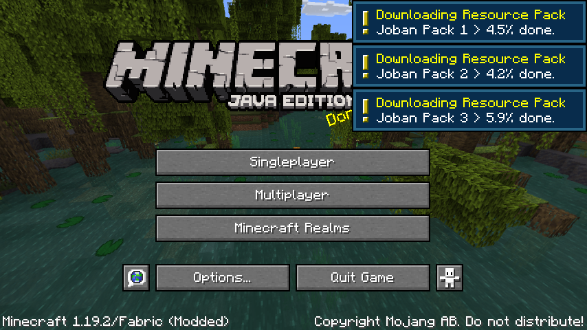

# Joban Resource Pack Helper
This is the resource pack updater to be used by The District of Joban for players, intended to replace the vanilla server resource pack.
**Work In Progress**

## Goal
- Preload the resource pack when the game launches, so the pack does not need to be loaded when joining the game.
- Allow players to update and reload the resource pack in-game, without leaving the server.
- Only apply the resource pack when in a particular server.

## Non-goal
- A catch-all solution to replace specialized tools/mods with the same goal in mind
- Protect your resource pack from external tampering

## License
This project is licensed under the [MIT License](LICENSE)